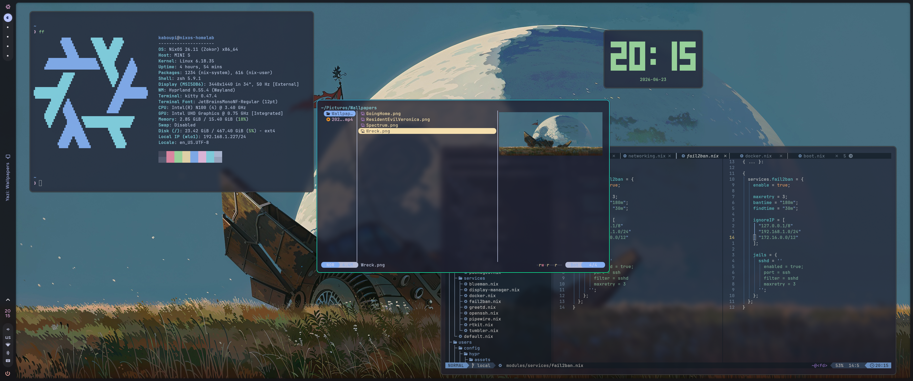

# NixOS Dotfiles

Modular NixOS configuration with Hyprland, built on Nix Flakes.



---

> [!WARNING]
> 
> This repo is under active changes,
> clone and use **at your own risk**!

Not yet tested / implemented:
- Test `caelestia-shell` install from scratch
- `Hyprland` Lua-cification (0.55)
- Configs for `rofi`
- Configs and plugins for `yazi`
- Fixes to `mpv` when fullscreen

---

## Prerequisites

- EFI-capable system (for systemd-boot)
- Internet connection (wired recommended for initial setup)

## From a Fresh Boot (Clean Install)

This covers everything from an empty disk to a working Hyprland desktop.

### 1. Partition and format disks

Partition the disk, format and mount partitions

### 2. Clone this repository

```bash
# Ensure git and flakes are available (they should be in the installer)
nix-shell -p git
mkdir -p /mnt/etc
git clone https://github.com/Kaboupi/nixos-dotfiles.git /mnt/etc/nixos/
cd /mnt/etc/nixos
```

### 3. Generate initial hardware configuration

```bash
nixos-generate-config --root /mnt --show-hardware-config > hosts/desktop/hardware.nix
```

This creates and moves `hardware-configuration.nix` (renamed as `hardware.nix`)
— crucial file for NixOS to boot.

### 4. Configure

Edit `config.nix` with your parameters:

```nix
{
  username = "username";
  hostname = "my-nixos";
  sshPorts = [ 2222 ];

  # Other params...
}
```

Stage all files (Nix evaluates from the git tree):

```bash
git add -A
```

### 5. Install

```bash
nixos-install --flake .#my-nixos --no-root-passwd
```

> Replace `my-nixos` with your `hostname` from `config.nix` if changed.

The `--no-root-passwd` flag skips setting a root password during install.
You will configure `sudo` access through the user's `wheel` group instead.

### 6. Reboot

```bash
umount -R /mnt
reboot
```

After reboot, SDDM will launch and offer a Hyprland session. Log in with your username.

## From a Working NixOS System

This covers pulling updates and applying the configuration on an
already-installed NixOS machine.

### 1. Clone the repo (if not already present)

```bash
git clone https://github.com/Kaboupi/nixos-dotfiles.git
cd nixos-dotfiles
```

### 2. Update hardware configuration (if needed)

If your hardware changes or this is the first time
using this repo on an existing system:

```bash
nixos-generate-config --show-hardware-config > hosts/desktop/hardware.nix
git add -A
```

### 3. Apply configuration

```bash
sudo nixos-rebuild switch --flake .#my-nixos
```

This builds the system profile and switches to it atomically.

### 4. Update flake inputs

To update nixpkgs and home-manager to their latest versions:

```bash
nix flake update
sudo nixos-rebuild switch --flake .#my-nixos
```

## Customization

### Changing packages

Edit `config.nix`:

```nix
# user packages
userPackages = [
  "curl"
  "git"
  # add more here
];

# additional system packages
extraPackages = [
];
```

### Adding a new host

1. Create a new directory under `hosts/` (e.g., `hosts/laptop/`)
2. Add a `hardware.nix` and `default.nix` that imports the modules you need
3. Add a new entry in `flake.nix`:

```nix
nixosConfigurations."laptop" = mkHost "laptop";
```

## Troubleshooting

### **`nixos-rebuild` fails with missing files**

All files must be tracked by git. Run `git add -A` before rebuilding.

### **Boot fails after install**

Verify `hosts/desktop/hardware.nix` contains your actual hardware configuration.
You can boot from a live USB, mount your root partition, and regenerate it.

### **SDDM does not show Hyprland session**

Ensure `programs.hyprland.enable = true` in `modules/desktop/hyprland.nix`
and `services.displayManager.sddm.enable = true` in `modules/desktop/display-manager.nix`.
